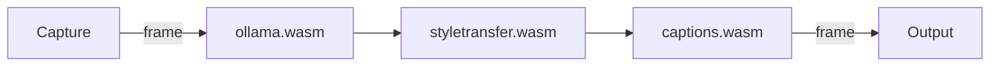
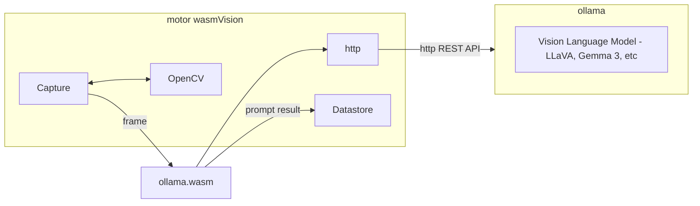
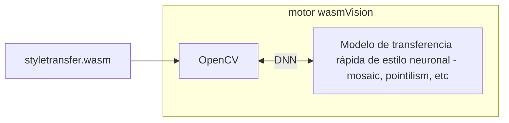
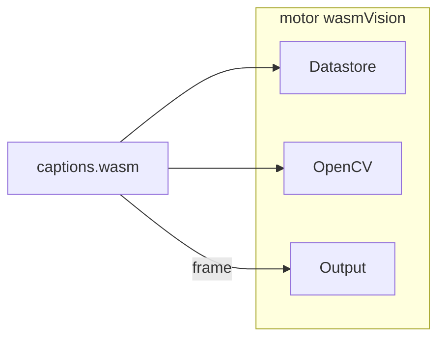
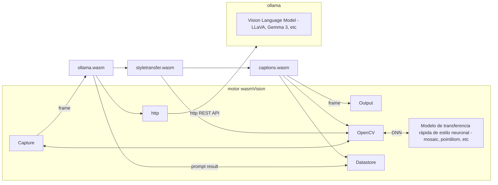

```mermaid
flowchart LR

Capture--frame-->ollama.wasm
ollama.wasm-->styletransfer.wasm
styletransfer.wasm-->captions.wasm
captions.wasm--frame-->Output

```

```mermaid
flowchart LR

subgraph motor wasmVision
    Capture
    Capture<-->OpenCV
    http
    Datastore
end

Capture--frame-->ollama.wasm

ollama.wasm-->http
http--http REST API-->ollama
subgraph ollama
    vlm[Vision Language Model - LLaVA, Gemma 3, etc]
end
ollama.wasm--prompt result-->Datastore

```

```mermaid
flowchart LR

subgraph motor wasmVision
    OpenCV<--DNN-->DNN[Modelo de transferencia rápida de estilo neuronal - mosaic, pointilism, etc]
end

styletransfer.wasm-->OpenCV

```

```mermaid
flowchart LR

subgraph motor wasmVision
    Datastore
    OpenCV
    Output
end

captions.wasm-->Datastore
captions.wasm-->OpenCV
captions.wasm--frame-->Output

```

```mermaid
flowchart LR

ollama.wasm-->styletransfer.wasm
styletransfer.wasm-->captions.wasm
captions.wasm--frame-->Output

subgraph motor wasmVision
    Capture
    Capture<-->OpenCV
    OpenCV<--DNN-->DNN[Modelo de transferencia rápida de estilo neuronal - mosaic, pointilism, etc]
    http
    Datastore
    Output
end
subgraph ollama
    vlm[Vision Language Model - LLaVA, Gemma 3, etc]
end

Capture--frame-->ollama.wasm

ollama.wasm-->http
http--http REST API-->ollama
ollama.wasm--prompt result-->Datastore

styletransfer.wasm-->OpenCV

captions.wasm-->Datastore
captions.wasm-->OpenCV

```
