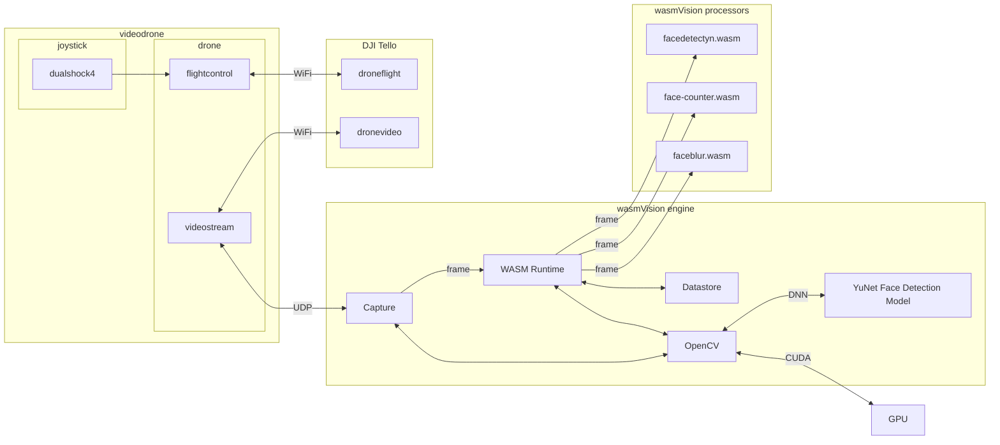

```mermaid
flowchart LR
subgraph videodrone
    subgraph joystick
        dualshock4
    end
    subgraph drone
        dualshock4-->flightcontrol
        videostream
    end
end
subgraph wasmVision engine
    videostream<--UDP-->Capture
    Runtime[WASM Runtime]
    Runtime<-->Datastore
    Capture--frame-->Runtime
    Capture<-->OpenCV
    Runtime<-->OpenCV
    OpenCV<--DNN-->YuNet[YuNet Face Detection Model]
end
OpenCV<--CUDA-->GPU
subgraph wasmVision processors
    Runtime--frame-->facedetectyn.wasm
    Runtime--frame-->face-counter.wasm    
    Runtime--frame-->faceblur.wasm
end
subgraph DJI Tello
    flightcontrol<-- WiFi -->droneflight
    videostream<-- WiFi -->dronevideo
end
```
