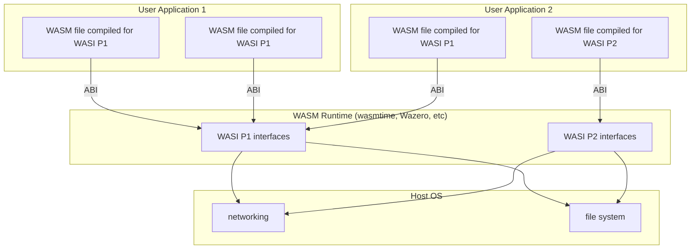

```mermaid
flowchart
    subgraph "User Application 1"
        WASMP1A[WASM file compiled for WASI P1]
        WASMP1B[WASM file compiled for WASI P1]
    end
    subgraph "User Application 2"
        WASMP2A[WASM file compiled for WASI P1]
        WASMP2B[WASM file compiled for WASI P2]
    end
    subgraph "WASM Runtime (wasmtime, Wazero, etc)"
        P1[WASI P1 interfaces]
        P2[WASI P2 interfaces]
    end
    WASMP1A--ABI-->P1
    WASMP1B--ABI-->P1
    WASMP2A--ABI-->P1
    WASMP2B--ABI-->P2
    subgraph "Host OS"
        net[networking]
        files[file system]
    end
    P1-->files
    P1-->net
    P2-->files
    P2-->net
```
