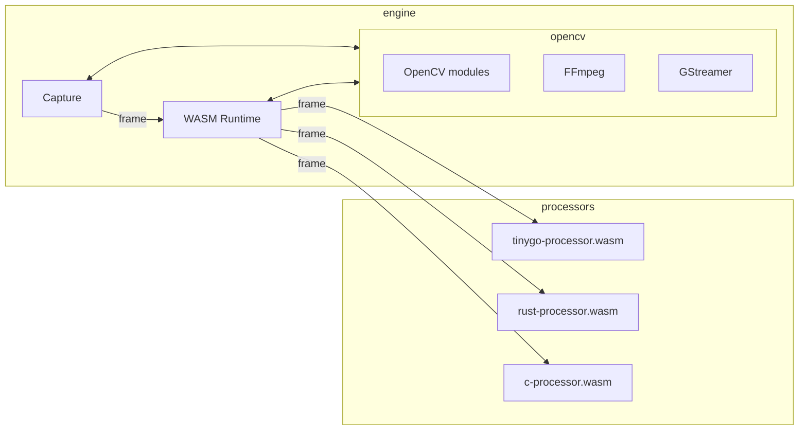

```mermaid
flowchart LR
    subgraph engine
        Capture
        Runtime[WASM Runtime]
        Capture--frame-->Runtime
        Capture<-->opencv
        Runtime<-->opencv
    end
    subgraph opencv
        modules[OpenCV modules]
        FFmpeg
        GStreamer
    end
    subgraph processors
        Runtime--frame-->tinygo-processor.wasm
        Runtime--frame-->rust-processor.wasm
        Runtime--frame-->c-processor.wasm
    end
```
