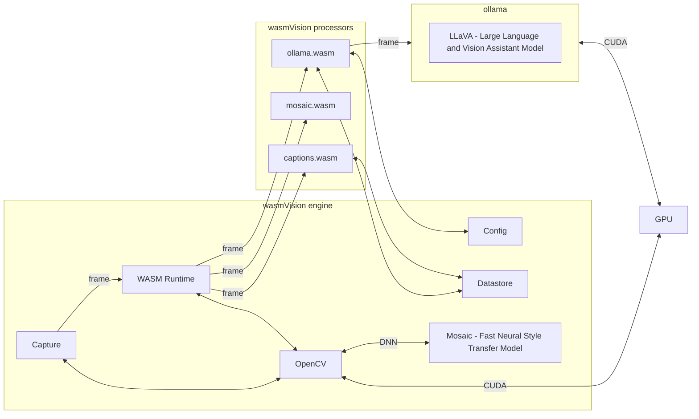

```mermaid
flowchart LR
    subgraph wasmVision engine
        Capture
        Runtime[WASM Runtime]
        Capture--frame-->Runtime
        Capture<-->OpenCV
        Runtime<-->OpenCV
        Config
        Datastore
        OpenCV<--DNN-->DNN[Mosaic - Fast Neural Style Transfer Model]
    end
    subgraph wasmVision processors
        Runtime--frame-->ollama.wasm
        Runtime--frame-->mosaic.wasm
        Runtime--frame-->captions.wasm
    end
    ollama.wasm--frame-->ollama
    subgraph ollama
        llava[LLaVA - Large Language and Vision Assistant Model]
    end
    ollama.wasm<-->Config
    ollama.wasm<-->Datastore
    captions.wasm<-->Datastore
    OpenCV<--CUDA-->GPU
    ollama<--CUDA-->GPU
```
